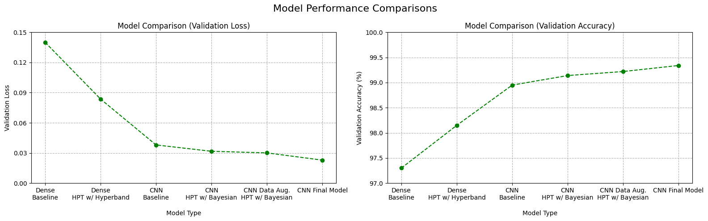

# Machine Learning - Deep Neural Networks Using TensorFlow
Deep Neural Networks classification of handwritten digits using the MNIST dataset.

## Results
**Final Model - Test Accuracy: 99.4%**

## DNN Architecture and ML Workflow

### Preprocessing
- 70,000 28x28x1 images split into 50k/10k/10k train/validation/test, with additional data augmentation on the training set performed later in the model-improvement process.
- Pixel intensity values of integers between 0-255 were scaled to floats between 0-1.

#### Architecture
- Two main architecture types were explored: sequences of fully-connected layers and CNNs...
- Flattened, fully-connected input layer; 28x28x1 flattened to 784x1.
- Multiple fully-connected hidden layers. For baseline model, used 2 layers, each with 50 neurons and ReLU activation function.
- Output layer of size 10, representing 10 different digit classses. Softmax activation function connecting to output layer.
- Adaptive Moment Estimation used for optimizer and Sparse Categorical Crossentropy used for loss.
- Early stopping implemented to prevent overfitting. Stopped when validation loss began increasing with a patience factor of 2 and restore_best_weights=True (i.e., once val_loss increased for 2 consecutive epochs, stop training and "roll back" by 2 epochs). Note: 5 epochs was used for the simple baseline model instead of early stopping.

## Hyperparameter Tuning
- Tuned the following hyperparameters by manually implementing 4 for loops to explore all 90 combinations, though in practice using an API like Keras Tuner's Bayesian Hyperparameter Optimization or scikit-learn's GridSearchCV would generally be better.
  - hidden_layer_sizes = [32, 64, 128, 256, 512] # Number of neurons in 1st hidden layer
  - hidden_layer_size_decreases = ['constant', 'half'] # Use same number of neurons for all hidden layers, or decrease by half each layer
  - hidden_layer_depths = [2, 3, 4]
  - activation_functions = ['relu', 'elu', 'tanh']
 
- Conclusion: The highest validation accuracy from all hyperparameter combinations was 99.88%, which only had a 0.03% difference from the training accuracy; therefore this was considered the best model. Finally, the test dataset was utilized to evaluate the model associated with this validation accuracy; this final model achieved a 98.01% accuracy on the test dataset.
  - Test accuracy: 98.01% | Validation accuracy: 99.88% | Train accuracy: 99.85%
  - Epochs trained (until overfitting began): 23 | Training time: 0min 28sec
  - Best Hyperparameters: {'hidden_layer_size': 128, 'hidden_layer_size_variation': 'constant', 'hidden_layer_depth': 2, 'activation_function': 'tanh'}

## Future Ways to Improve on This Specific Dataset
- Use an API like Keras Tuner's Bayesian Hyperparameter Optimization
- Explore a CNN architecture on the same dataset
- Data Augmentation, such as slight rotations or shifts (NOT flips though), on the input images
- Regularization adjustments, like dropout and/or L2
- Ensemble multiple models together, though this will increase inference time
