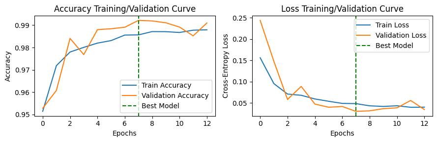
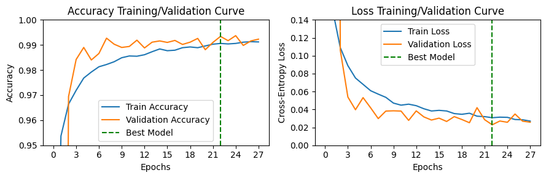
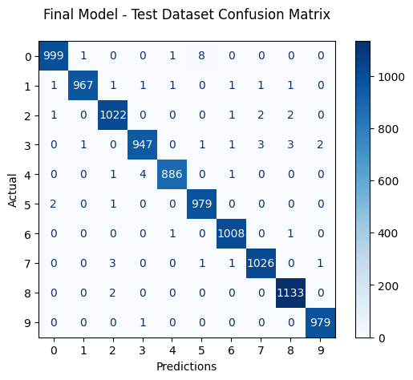

# Machine Learning - Image Classification with TensorFlow
Deep Neural Networks classification of handwritten digits using the MNIST dataset.

## Results
**Final Model - Test Accuracy: 99.46%**

## DNN Architecture and ML Workflow

### Overview / Table of Contents
1) [Preprocessing was performed on the dataset of 70,000 images.](#1-preprocessing)
2) [Feedforward neural network (FNN) baseline model built.](#2-feedforward-neural-network-fnn-baseline-model)
3) [Hyperparameter tuning performed on FNN using Keras Tuner's Hyperband.](#3-fnn-hyperparameter-tuning)
4) [Convolutional neural network (CNN) baseline model built.](#4-convolutional-neural-network-cnn-baseline-model)
5) [Bayesian Optimization CNN hyperparameter tuning.](#5-cnn-hyperparameter-tuning)
6) [Data augmentation on training dataset.](#6-cnn-data-augmentation-hyperparameter-tuning)
7) [Optimizing Learning Rate on Results of HPT Experiments](#7-cnn-learning-rate-optimization-on-results-from-previous-2-hpt-experiments)
8) [Final model chosen and evaluated on test dataset.](#7=8-final-model-and-testing)

### 1. Preprocessing
- 70,000 28x28x1 images of handwritten digits 0-9, split into 50k/10k/10k train/validation/test datasets, with additional data augmentation on the training set performed later in the model-improvement process.
- Pixel intensity values of integers between 0-255 were scaled to floats between 0-1.
- For CNN architectures, a channel dimension was also added to the input arrays.
- Batching was handled later during training in the tf Model.fit() method.

### 2. Feedforward Neural Network (FNN): Baseline Model
- Input layer: 28x28 preprocessed images flattened to 1x784.
- Multiple fully-connected/dense hidden layers. For baseline model, used 2 sets of dense+dropout hidden layers were used, each with 64 neurons and ReLU activation function.
- Output layer of size 10, representing 10 different digit classses. Softmax activation function connecting to output layer.
- Adaptive Moment Estimation used for optimizer and Sparse Categorical Crossentropy used for loss.
- Early stopping implemented to prevent overfitting. Stopped when validation loss began increasing with a patience factor of 5 and restore_best_weights=True (i.e., once val_loss increased for 5 consecutive epochs, stop training and "roll back" by 5 epochs).

### 3. FNN: Hyperparameter Tuning
The following hyperparameters were tuned with Keras Tuner's Hyperband.

| Hyperparameter            | Range                           | Best   | Description |
|---------------------------|---------------------------------|--------|-------------|
| `num_hidden_layers`       | [1, 2, 3]                       | 1      | Number of pairs of dense + dropout layers |
| `hidden_layer_size`       | [32, 64, 128, 256]              | 256    | Number of neurons in each dense layer |
| `activation`              | ['relu', 'tanh']                | 'relu' | Activation function used in all but output layer |
| `dropout_rate`            | [0.1 - 0.5 with step=0.05]      | 0.4    | Dropout rate for regularization dropout layers |
| `l2_strength`             | [0.0001, 0.001, 0.01]           | 0.0001 | L2 regularization (ridge regression) factor |
| `learning_rate`           | [0.0001 - 0.01 with step=0.001] | 0.0001 | Learning rate for the optimizer |
 

The best Hyperband model was re-trained with the best-performing hyperparameter combination, and allowed to train with an early stopping patience=10 (instead of the patience=5 used in Hyperband).
**Best FNN Architecture: Results After 92 Epochs:**
 - Accuracy: Train=99.30% | Val=98.15%
 - Loss: Train=0.0471 | Val=0.0836

 
### 4. Convolutional Neural Network (CNN): Baseline Model
- Input layer: 28x28x1 preprocessed images
- Multiple convolutional and subsampling layers, followed by a dense layer and the output layer. For baseline model, used 2 pairs of convolutional+max pooling layers, with a 3x3 convolutional window containing 32 and 64 filters, padding='same', 2x2 pooling size, dense layer size of 64 neurons, and ReLU activation function.
- Output layer of size 10, representing 10 different digit classses. Softmax activation function connecting to output layer.
- Adaptive Moment Estimation used for optimizer and Sparse Categorical Crossentropy used for loss.

### 5. CNN: Hyperparameter Tuning
The following hyperparameters were tuned with Keras Tuner's Bayesian Optimization. Batch normalization was also added after each convolutional layer and after the dense layer.

| Hyperparameter            | Range                      | Best         | Description |
|---------------------------|----------------------------|--------------|-------------|
| `num_conv_layers`         | [2, 3]                     | 3            | Number of pairs of convolutional + subsampling layers |
| `num_filters_first_layer` | [16, 32]                   | 16           | Number of filters in the first convolutional layer |
| `num_filters_sub_layers`  | [32, 64]                   | 32           | Number of filters in the subsequent convolutional layers |
| `kernel_size`             | [3, 5]                     | 5            | Size of the convolutional kernel |
| `subsample_type`          | ['2x2pool', '5x5stride2']  | '5x5stride2' | 2x2 max pooling layer vs. a 5x5 convolution with stride 2 for subsampling |
| `dense_layer_size`        | [64, 128, 256]             | 256          | Number of units in the dense (fully connected) layer |
| `activation`              | ['relu', 'tanh']           | 'relu'       | Activation function used in all but output layer |
| `dropout_rate`            | [0.1 - 0.5 with step=0.1]  | 0.4          | Dropout rate for regularization dropout layers |
| `learning_rate`           | [0.0001, 0.001, 0.01]      | 0.01         | Learning rate for the optimizer |

The results of this HPT process were then used in the data augmentation HPT in the next section.

### 6. CNN: Data Augmentation Hyperparameter Tuning
The network structure-defining hyperparameters from the previous HPT were used in a new HPT, but this time focusing on data augmentation. The following hyperparameters were tuned with Bayesian Optimization. These focused on spatial augmentations, such as rotating, zooming, and translating images. The dropout and learning rate from the previous experiment were not re-used, in order to allow greater flexibility during this second HPT.

| Hyperparameter            | Range                                 | Best            | Description |
|---------------------------|---------------------------------------|-----------------|-------------|
| `rotation_range`           | [0.0, 0.3 with step=0.05]            | 0.05            | Range of random rotations |
| `zoom_range`               | [0.0, 0.1 with step=0.05]            | 0.0             | Range of random zoom |
| `width_shift_range`        | [0.0, 0.2 with step=0.05]            | 0.15            | Range of random horizontal shifts |
| `height_shift_range`       | [0.0, 0.2 with step=0.05]            | 0.1             | Range of random vertical shifts |
| `dropout_rate`             | [0.1 - 0.5 with step=0.1]            | 0.2             | Dropout rate for regularization dropout layers |
| `learning_rate`            | [0.0001, 0.0005, 0.001, 0.005, 0.01] | 0.01            | Learning rate for the optimizer |

The best Bayesian Optimization model was re-trained with the best-performing hyperparameter combination, achieving an accuracy of 99.22% and loss of 0.0301 on the validation dataset. However, after plotting the training/validation curves, it was clear that the solution-convergence was irregular, so a final optimization was performed to explore slower learning rates.
**Results After 7 Epochs:**
 - Accuracy: Train=98.57% | Val=99.22%
 - Loss: Train=0.0483 | Val=0.0301

 
### 7. CNN: Learning Rate Optimization on Results from Previous 2 HPT Experiments
Several learning rates (0.0001, 0.0005, 0.0008, 0.001, 0.002, 0.003, 0.0005, 0.01) were tested using GridSearchCV. All other hyperparameters defining the neural network's architecture and the data augmentation pipeline were set to match the results of the previous 2 HPT experiments in sections 5 and 6. The best learning rate was repeatedly found to be 0.001 and the final model achieved a validation loss of 0.0229.

**Final CNN Model: Results After 22 Epochs:**
- Accuracy: Train=99.06% | Val=99.34%
- Loss: Train=0.0308 | Val=0.0229

### 8. Final Model and Testing
Now that that overall architecture was chosen to be a CNN and the hyperparameters chosen through a sequence of 3 hyperparameter tuning experiments, the model with the lowest validation loss was chosen as the final model. It was then evalauted on the test dataset and achieved an **accuracy of 99.46%** and **loss of 0.0175**. The predictions can be visualized through the below confusion matrix.

Finally, the progression of each model type and their performances can be seen on the [plot in the beginning of this README](#results).
